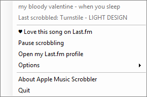
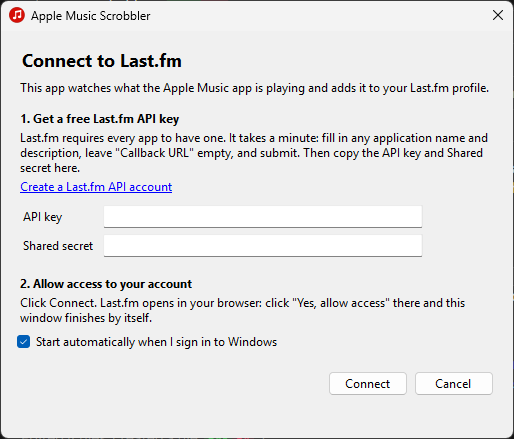

<p align="center"></p>

# Apple Music Scrobbler

Scrobble the **Apple Music app** to **Last.fm**, on **Windows** and **Mac**. No browser extension and no iTunes needed.

The Apple Music app on Windows 11/10 doesn't support Last.fm, and the Music app on the Mac doesn't either. This small app sits in the Windows tray or the Mac menu bar, watches what Apple Music is playing and sends it to your Last.fm profile.

<p align="center"></p>

- **Now playing** shows up on your Last.fm profile while a song plays
- **Scrobbles** follow Last.fm's rules: songs longer than 30 seconds count once you've played half of them or 4 minutes, whichever comes first
- **Clean titles**: *"Song [2022 Remaster]"* is scrobbled as *"Song"* and *"Album (Deluxe Edition)"* as *"Album"*, so your plays land on the normal Last.fm pages (this can be turned off)
- **Works offline**: scrobbles are saved and sent when you're back online
- **Discord status**: *Listening to Apple Music* on your Discord profile, with the song, artist, album art, a progress bar and an Apple Music link (this can be turned off)
- **♥ Love** the current song from the tray menu
- **Update notifications** when a new version is released
- **Windows**: a single ~80 KB `.exe`. There's no installer and nothing else to download, because it uses the .NET Framework 4.8 that already comes with Windows 10/11
- **Mac**: a native menu bar app of about 1 MB for macOS 13 Ventura or newer, on Apple Silicon and Intel

## Install on Windows

1. Download `AppleMusicScrobbler.exe` from the [latest release](../../releases/latest).
2. Put it somewhere permanent, for example `%LOCALAPPDATA%\Programs\AppleMusicScrobbler\`. The "Start with Windows" option points at wherever the exe is.
3. Run it. The setup window walks you through connecting your Last.fm account.

> **Windows SmartScreen** may warn about an unrecognized app because the exe isn't code-signed. Click **More info → Run anyway**, or build it yourself from source (see below). Each release lists the exe's SHA-256 so you can verify your download.

To update, quit the app from the tray menu, replace the exe, and start it again. Your settings and login are kept.

## Install on Mac

1. Download `AppleMusicScrobbler-macOS.zip` from the [latest release](../../releases/latest) and double-click it to unzip.
2. **Move *Apple Music Scrobbler* to your Applications folder** before opening it. Opened straight from Downloads, macOS runs it from a temporary copy, and *Start at login* won't work.
3. Open it. The first time, macOS blocks it because it isn't notarized by Apple (that needs a paid Apple developer account). To allow it once:
   - Click **Done** on the warning.
   - Open **System Settings › Privacy & Security**, scroll down to *"Apple Music Scrobbler" was blocked*, and click **Open Anyway**. Confirm with your password.

   On macOS 15 and later, right-click › Open no longer skips this. Each release lists the zip's SHA-256 so you can verify your download, or you can build it yourself (see below).
4. The setup window walks you through connecting Last.fm. It also asks for access to Music: click **Allow** when macOS asks *"Apple Music Scrobbler" wants access to control "Music"*. The app only reads how far into a song you are, so songs you play on repeat count every time. Everything else works without it.

The app lives in the menu bar as a ♪ note. There's no Dock icon. To update, quit it from the menu, replace the app in Applications with the new one, and open it again. Your settings, login and Music permission are kept.

### About the Last.fm API key

Release builds include an API key, so you only need to click **Connect** and then **Yes, allow access** on Last.fm.

If you built the app yourself without a key, setup asks you to create one. It's free and takes a minute:

<details>
<summary>Creating a Last.fm API key</summary>



1. Open [last.fm/api/account/create](https://www.last.fm/api/account/create) while signed in to Last.fm.
2. Enter any application name and description, and leave **Callback URL** empty.
3. Copy the **API key** and **Shared secret** into the setup window and click **Connect**.
4. Click **Yes, allow access** on the Last.fm page that opens.

</details>

## Usage

On Windows the app lives in the system tray as a red note icon (you may need to click the **^** arrow to see it). On the Mac it's the ♪ note in the menu bar. Click it for:

| Menu item | What it does |
| --- | --- |
| *Now playing / Last scrobbled* | Status |
| ♥ Love this song on Last.fm | Loves the current track |
| Pause scrobbling | Stops sending anything (the icon turns grey) |
| Open my Last.fm profile | Opens your profile in the browser |
| Options › Start with Windows / Start at Login | Runs automatically when you sign in |
| Options › Show "Listening to" on Discord | Shows the current song on your Discord profile while the Discord app is running (on by default; hidden while paused) |
| Options › Clean up titles | Removes "Remaster", "Deluxe Edition", "- Single" and similar from names (on by default) |
| Options › Check for updates automatically | Checks GitHub once a day (on by default) |
| Options › Switch Last.fm account... | Reconnects, or connects a different account |
| Options › Open log | Shows what was sent and any errors |
| Allow Access to Music… *(Mac)* | Shown only if Music access isn't allowed yet |

## How it works

- **Windows**: reads the Windows **System Media Transport Controls** session belonging to Apple Music (`AppleInc.AppleMusicWin`), polling once a second.
- Apple Music for Windows reports the artist field as `Artist — Album` and leaves the album empty. The app splits that field back into artist and album.
- **Mac**: listens to the `com.apple.Music.playerInfo` notification the Music app sends whenever a song starts, pauses or changes (this needs no permission). The notification doesn't include the playback position, and Music sends nothing when a song restarts on Repeat One, so the app also asks Music for its position once a second with AppleScript (that's the Automation permission). Without the permission it estimates the position with its own clock.
- Both versions use the same scrobble rules, title cleanup and Discord status, and share their unit tests.
- Calls the [Last.fm API](https://www.last.fm/api) directly: `track.updateNowPlaying`, `track.scrobble` (in batches of up to 50) and `track.love`. Sign-in uses Last.fm's [desktop auth flow](https://www.last.fm/api/desktopauth), so the app never sees your password.
- The Discord status goes through the Discord desktop app's local Rich Presence connection. Nothing is sent to Discord's servers by this app directly. Album art and Apple Music links come from Apple's public [iTunes Search API](https://performance-partners.apple.com/search-api).

### Your data

On Windows, everything is stored in `%APPDATA%\AppleMusicScrobbler\`:

- `settings.xml`: your options, your Last.fm username, and the session key and API secret encrypted with Windows DPAPI, so only your Windows user can read them
- `queue.xml`: scrobbles waiting to be sent
- `scrobbler.log`: activity log, capped at about 1 MB

On the Mac:

- Options are in the app's preferences (`~/Library/Preferences/io.github.ivanxfernandez.AppleMusicScrobbler.plist`)
- `~/Library/Application Support/AppleMusicScrobbler/secrets.json`: the Last.fm session key (and your API secret, if you use your own key), readable only by your Mac user
- `~/Library/Application Support/AppleMusicScrobbler/queue.json`: scrobbles waiting to be sent
- `~/Library/Logs/AppleMusicScrobbler/scrobbler.log`: activity log, capped at about 1 MB (*Options › Open log* opens it in Console)

The app talks to `ws.audioscrobbler.com` (Last.fm's API), `itunes.apple.com` (album art for Discord), `api.github.com` (update checks), and the Discord app on your computer.

## Known limitations

- Only the Apple Music app is supported, not iTunes or Apple Music in a browser. For the web player, use [Web Scrobbler](https://web-scrobbler.com/).
- Radio stations and other streams with no artist aren't scrobbled.
- Repeat detection depends on Apple Music reporting the playback position. If you play the same song twice in a row, it normally scrobbles twice. On the Mac without Music access, a repeat after you've skipped around in the song can be missed.

## Building

### Windows

Requires the [.NET SDK](https://dotnet.microsoft.com/download) (8 or later) on Windows.

```bash
dotnet build AppleMusicScrobbler.sln -c Release
```

```bash
dotnet test AppleMusicScrobbler.sln -c Release
```

The exe is written to `src/AppleMusicScrobbler/bin/Release/net48/AppleMusicScrobbler.exe`.

Optional build properties:

| Property | Purpose |
| --- | --- |
| `-p:LastFmApiKey=…` `-p:LastFmApiSecret=…` | Bake in a Last.fm API key so users skip creating their own. Pass it only at build time and keep it out of the repository. |
| `-p:GitHubRepo=owner/repo` | Turn on update checks against that repository's releases. |
| `-p:DiscordClientId=…` | Use a different Discord application for the status (its name is what appears after "Listening to"). An empty value hides the feature. |
| `-p:Version=1.2.3` | Set the version. |

### Mac

Requires the Xcode Command Line Tools (`xcode-select --install`); full Xcode isn't needed. The code is in [`macos/`](macos): a Swift package with the app and its tests.

```bash
cd macos
```

```bash
swift test
```

```bash
./build-app.sh
```

That writes `macos/build/Apple Music Scrobbler.app` and a zip of it. The same values as on Windows can be passed as environment variables: `LASTFM_API_KEY`, `LASTFM_API_SECRET`, `GITHUB_REPO`, `DISCORD_CLIENT_ID`. `UNIVERSAL=1` builds for Intel too. Run the app with `--dry-run` (`open "build/Apple Music Scrobbler.app" --args --dry-run`) to log instead of sending.

### Releasing

The [Release workflow](.github/workflows/release.yml) does all of this automatically:

1. Add the repository secrets `LASTFM_API_KEY` and `LASTFM_API_SECRET` (*Settings › Secrets and variables › Actions*) once.
2. Update [CHANGELOG.md](CHANGELOG.md), then tag and push:
   ```bash
   git tag v1.1.0
   ```
   ```bash
   git push origin v1.1.0
   ```
3. GitHub Actions runs the tests on Windows and macOS, builds the exe and the Mac app with the key, version and repository baked in, and publishes one release with both. Installed copies notify their users within a day.

### Developer options

- `AppleMusicScrobbler.exe --dry-run` logs what it would send, without contacting Last.fm.
- `tools/screenshots.ps1` regenerates the README screenshots (`docs/menu.png`, `docs/setup.png`).
- `tools/make-icon.ps1` regenerates `app.ico` from `IconFactory.cs`.

## Uninstall

**Windows**: untick **Options › Start with Windows** in the tray menu, then choose **Quit**. Delete the exe and the `%APPDATA%\AppleMusicScrobbler` folder.

**Mac**: untick **Options › Start at Login**, choose **Quit**, and move the app to the Trash. To remove its data too, delete `~/Library/Application Support/AppleMusicScrobbler`, `~/Library/Logs/AppleMusicScrobbler` and `~/Library/Preferences/io.github.ivanxfernandez.AppleMusicScrobbler.plist`.

## License

[MIT](LICENSE)

*Not affiliated with Apple or Last.fm.*
